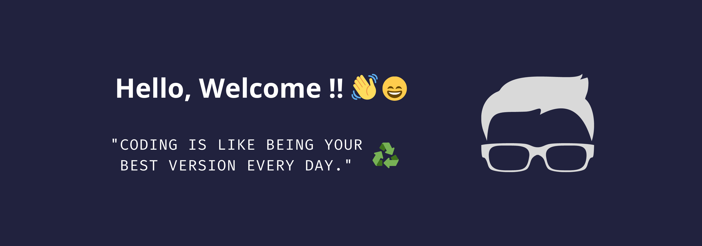

My name's Rene, to work in tech since of 2018. Current to act how Front-end Developer at [Docket](https://docket.com.br).

#### :books: My focus of studies current:

- English
- Javascript / React / Gatsby
- Design UI / UX

#### :palm_tree: In free time I like:

- Cook :bread:
- Read books :book:
- Play games :joystick:
- Coding projects personal :computer:
- I like to go the park relax :deciduous_tree:
- Study about development personal :recycle:
- Watch series, movies, podcast and to listen music :tv: :headphones:

#### :triangular_flag_on_post: Where me find?

<!--
**ReneSena/ReneSena** is a ✨ _special_ ✨ repository because its `README.md` (this file) appears on your GitHub profile.

Here are some ideas to get you started:

- 🔭 I’m currently working on ...
- 🌱 I’m currently learning ...
- 👯 I’m looking to collaborate on ...
- 🤔 I’m looking for help with ...
- 💬 Ask me about ...
- 📫 How to reach me: ...
- 😄 Pronouns: ...
- ⚡ Fun fact: ...
-->
